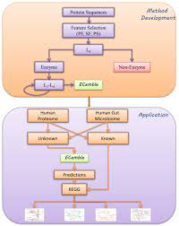

<!-- <div align="center">
  
</div> -->

---

<h1 align="center">
  ECemble
</h1>

<h4 align="center">
  A data mining suite for enzyme classification
</h4>

<p align="center">
  <a href="http://ECemble.readthedocs.io">
    
  </a>
  <a href="https://travis-ci.org/akram-mohammed/ECemble">
    
  </a>
  <a href="https://saythanks.io/to/akram-mohammed">
    
  </a>
  <a href="https://paypal.me/akram9">
    
  </a>
</p>

**ECemble** is an open source ensemble machine learning pipeline tool (released under the [GNU General Public License v3](LICENSE.md)) that allow users to efficiently and automatically process proteomes to predict enzyme and enzyme classes from unannotated protein sequences. ECemble uses various learning algorithms to generate multiple prediction models that distinguish different classes of enzymes, where it first predicts if a protein is an enzyme or a non-enzyme, and then subsequently predict specific class and subclass of an enzyme in the EC number hierarchy. The predictions are selected when at least two of the three top-performing ML classifiers show consistent predictions.

**Citation:** If you use this resource, please cite the following reference: 
Mohammed A, Guda C. **Application of Hierarchical enzyme classification method reveals the role gut microbiome in human metabolism.** BMC Genomics 2015 https://bmcgenomics.biomedcentral.com/articles/10.1186/1471-2164-16-S7-S16

***Note***: ECemble is an open-source software, in case if you run across bugs or errors, raise an issue over [here](https://github.com/akram-mohammed/ECemble/issues).

### Table of Contents
* [Downloading ECemble](#downloading-ecemble)
* [Dependencies](#dependencies)
* [System Requirements](#system-requirements)
* [Directory Structure of the Pipeline](#directory-structure-of-the-pipeline)
* [Execution of Pipeline](#execution-of-pipeline)
* [Contribution](#contribution)
* [License](#license)

This README file will serve as a guide for using this software tool. We suggest reading through the entire document at least once, in order to get an idea of the options available, and how to customize the pipeline to fit your needs.

### Downloading ECemble
Clone the git repository:
```console
$ git clone https://github.com/akram-mohammed/ECemble.git && cd ECemble
```

### Dependencies 
After downloading **ECemble**, make sure you install all the necessary software packages. 
```
cd ECemble
mkdir bin/lib/PFAM bin/lib/PROSITE bin/lib/SUPERFAMILY bin/lib/WEKA bin/lib/hmmer
```
#### Installing PFAM
```
cd bin/lib/PFAM
wget ftp://ftp.ebi.ac.uk/pub/databases/Pfam/releases/Pfam26.0/Pfam-A.hmm.gz
gunzip Pfam-A.hmm.gz
```
#### Installing HAMMER
```
cd bin/lib/hmmer
wget ftp://selab.janelia.org/pub/software/hmmer3/3.1b1/hmmer-3.1b1-linux-intel-x86_64.tar.gz
tar zxf hmmer-3.1b1-linux-intel-x86_64.tar.gz
rm hmmer-3.1b1-linux-intel-x86_64.tar.gz
./configure
make 
make check
./src/hmmpress ../PFAM/Pfam-A.hmm
```
#### Installing PROSITE
```
cd bin/lib/PROSITE
wget ftp://ftp.expasy.org/databases/prosite/ps_scan/ps_scan_linux_x86_elf.tar.gz
tar zxf ps_scan_linux_x86_elf.tar.gz
rm ps_scan_linux_x86_elf.tar.gz
wget ftp://ftp.expasy.org/databases/prosite/prosite.dat
```
#### Installing SCOP
```
cd bin/lib/SUPERFAMILY
ftp supfam.org
username: license
password: SlithyToves
cd models
get model.tab.gz
get hmmlib_1.75.gz
get self_hits.tab.gz
cd ../sequences
get pdbj95d.gz
cd ../scripts
mget *
bye

wget http://scop.mrc-lmb.cam.ac.uk/scop/parse/dir.des.scop.txt_1.75
wget http://scop.mrc-lmb.cam.ac.uk/scop/parse/dir.cla.scop.txt_1.75
mv dir.des.scop.txt_1.75 dir.des.scop.txt
mv dir.cla.scop.txt_1.75 dir.cla.scop.txt

gunzip pdbj95d.gz
gunzip model.tab.gz
gunzip hmmlib_1.75.gz
mv hmmlib_1.75 hmmlib
gunzip self_hits.tab.gz
chmod u+x *.pl
.././hmmer/src/hmmpress hmmlib
```
#Change the paths in ass3.pl, line 13-16
```
my $selfhits = "./../lib/SUPERFAMILY/self_hits.tab";
my $clafile      = "./../lib/SUPERFAMILY/dir.cla.scop.txt";
my $modeltab     = "./../lib/SUPERFAMILY/model.tab";
my $pdbj95d      = "./../lib/SUPERFAMILY/pdbj95d";
```
#Make changes in superfamily.pl
```
line 20	system "perl ../lib/SUPERFAMILY/fasta_checker.pl $ARGV[0] >../test/scratch/$file\_torun.fa";
line 24 system "../lib/hmmer/src/hmmscan -o ../test/scratch/$file.res -E 1e-04 -Z 15438 ../lib/SUPERFAMILY/hmmlib ../test/scratch/$file\_torun.fa";
line 28 system "perl ../lib/SUPERFAMILY/ass3.pl -t n -f 40 -e 0.0001 ../test/scratch/$file\_torun.fa ../test/scratch/$file.res ../test/scratch/$file.ass ";
#comment lines
line 31 print "Running ass_to_html\n";
line 32 system "ass_to_html.pl dir.des.scop.txt model.tab $file.ass > $file.html";
```
#### Installing WEKA
```
wget http://prdownloads.sourceforge.net/weka/weka-3-7-6.zip
unzip weka-3-7-6.zip
mv weka-3-7-6 ../lib/
rm weka-3-7-6.zip
cd ../lib/weka-3-7-6
jar -xvf weka.jar
jar -xvf weka-src.jar
```
Next, set the `WEKA` classpath by entering the following command in `.bashrc` file under Alias definitions:
```
export WEKAINSTALL=/absolute/path/to/weka/directory/`
export CLASSPATH=$CLASSPATH:$WEKAINSTALL/weka.jar
```
To install ECemble dependencies right from scratch, check out our exhaustive guides:
* [A Hitchhiker's Guide to Installing ECemble on Linux OS](https://github.com/akram-mohammed/ECemble/wiki/A-Hitchhiker's-Guide-to-Installing-ECemble-on-Linux-OS)
* [A Hitchhiker's Guide to Installing ECemble on Mac OS X](https://github.com/akram-mohammed/ECemble/wiki/A-Hitchhiker's-Guide-to-Installing-ECemble-on-Mac-OS-X)

### System Requirements
You will need current or very recent generations of your operating system: 
**Linux OS**, **Mac OS X**.

### Directory Structure of the Pipeline
After downloading **ECemble**, notice inside the **ECemble** directory there are all scripts necessary to process data:

### Execution of Pipeline
The downloaded scripts are used to extract features, train models for each of the 4 EC levels and test models. Please create a ticket under issues section to ask any question related to execution of any script. 

### Team
<table align="center">
  <tbody>
    <tr>
		<td align="center" valign="top">
			
			<br>
			<a href="https://github.com/akram-mohammed">Dr. Akram Mohammed</a>
			<br>
			<a href="mailto:akrammohd@gmail.com">akrammohd@gmail.com</a>
			<br>
			<p>Author and Maintainer</p>
		</td>
	 	<td align="center" valign="top">
			
			<br>
			<a href="https://www.unmc.edu/bsbc/people/guda.html">Dr. Babu Guda</a>
			<br>
			<a href="mailto:babu.guda@unmc.edu">babu.guda@unmc.edu</a>
			<br>
			<p>Principal Investigator</p>
		</td>
	  </tr>
  </tbody>
</table>
  

### License
This software has been released under the [GNU General Public License v3](LICENSE.md).
